# 连入服务器

> **写在开头**：

> 本文内容将长久在[cuberJ/ServerandDocker: 配置服务器连接和docker (github.com)](https://github.com/cuberJ/ServerandDocker)更新，若你此刻阅读的文档为PDF或者Markdown文件，可以在上述网址继续获取后续的更新内容！
> 
> 对于Linux操作不熟练的话，可以参考蒋砚军老师的本科Linux课程，我自己这门课的笔记放在了[cuberJ/LinuxNotes: Linux环境基础指令使用 (github.com)](https://github.com/cuberJ/LinuxNotes)
> 
> Git的操作笔记：[cuberJ/HowToUseGit: Github使用操作](https://github.com/cuberJ/HowToUseGit)

首先需要先从师兄师姐那里申请账号，密码，端口号和服务器所在的IP地址，再进行以下操作

## Mac用户

1. 打开系统自带的terminal，输入指令：
   
   ```shell
   格式为：ssh -p 端口号 用户名@IP地址
   例如：端口号为1000，用户名zhangsan，IP地址:192.168.1.1
   ssh -p 1000 zhangsan@192.168.1.1
   ```

2. 回车后，terminal会跳转至服务器登录页面，要求输入密码，输入登记的密码即可登录

## Windows用户

1. ~~ssh连接器可以考虑gitbash？~~~
2. 我自己用的<a href='https://termius.com/'>Termius</a>，感觉还可以（至少写这个推荐的时候处于高级版试用期中，等过了试用期再看情况来改评价吧🤡  更新：现在已经是文档写完后的第二年3月15日了，距离第一次写这段话都过去小半年了，依然还没用Windows跑过服务器，我是🕊石锤了）

## 服务器连接的一些情况

1. 如果terminal长时间没有输入信息，可能会断联。这时候不用慌，因为服务器大概率在一直运行，只是终端掉线了，只需要重新连接就行，基本不用担心没保存的东西丢失
   1. 当然，没事就:w总是一个好习惯
2. 实验室内部的不成文规定：文件尽量不要放在home文件夹下：
   1. 常见的错误：执行cd指令之后，bash会停留在自己的用户目录下，但是用户目录也是在home下的子目录，所以建议不要在自己的目录下面存啥大文件
   2. 尽量将大文件堆到store文件夹下

# 从0开始的服务器配置

由于一群人在一个系统里跑代码，环境随便配会混乱，所以每个人采用docker的方式运行自己的程序

该条目由管理员阅读并配置服务器Docker环境

version：2021年11月6日版

采用服务器T630，该服务器上Docker已完成配置

version：2022年4月4日版

2022年3月底由于实验室服务器搬迁，导致服务器49.142崩溃，于是花了一个礼拜挨个排除硬件问题和软件问题，重装了大概20次系统

现在说明docker，NVIDIA，ssh等基本服务的配置

version:2022年4月7日版

服务器又崩了，实际检测发现，**<u>18.04版本+5.4内核版本的启动盘就是个臭弟弟，一堆bug，功能不全，好一点的主板都无法兼容，建议改用20.04版本作为系统</u>**

version:2022年9月7日版

新的服务器（3080+2080ti，Asus主板）不认20.04的系统了，u盘开机找不到Ubuntu install选项，用了各种办法都不行，最后重做了启动盘，用了22.04版本的Ubuntu，所以现在20.04也是臭弟弟了

（按照当前的装机时间线，由此看来两年内实验室不能再买新的服务器了，不然24.04的Ubuntu还没出，装不了系统）

## ssh配置

推荐以安装ssh作为服务器重生的第一步，因为这样大家就不必非得在实验室泡着才能操作后续的步骤，而是可以溜到宿舍~~摸鱼划水~~继续配置

执行下面的命令

```shell
sudo apt-get update
sudo apt-get install openssh-server
sudo apt-get install vim
service ssh start
sudo apt-get install net-tools
sudo systemctl enable ssh # 开机自启动
sudo reboot
sudo systemctl status ssh # 查看重启后是否自启动，有Active：active(running)表示能够自启动了
```

## 硬盘配置

挂载新硬盘到服务器：

```shell
mkdir /store # 创建挂载用的目录
fdisk -l # 查看检测到的硬盘位置
#选择需要挂载的硬盘信息
mount /dev/disk1 /store #挂载到目录
df -hT # 查看挂载效果
```

挂载完毕后，由于是根目录下，大部分普通用户没有读写权限：

```shell
chmod -R 777 /store # 对所有用户开启读写权限
```

## docker配置

执行以下命令：

```shell
sudo apt-get install curl
curl -fsSL https://get.docker.com | bash -s docker --mirror Aliyun
docker ps -a
```

如果docker ps之后出现的内容是如下报错

```shell
Got permission denied while trying to connect to the Docker daemon socket at unix:///var/run/docker.sock: Post "http://%2Fvar%2Frun%2Fdocker.sock/v1.24/images/create?fromImage=lbjcom%2Fcuda10.1-pytorch1.7.1&tag=latest": dial unix /var/run/docker.sock: connect: permission denied
```

可以执行一下这个指令：

```shell
sudo setfacl --modify user:bupt630:rw /var/run/docker.sock
```

再实验一下能否运行

```shell
docker pull hello-world
docker images
docker run --name tmprun -it hello-world
```

由于我们大部分时间是需要利用GPU的，所以还需要使用参数`--gpus all`.所以需要安装NVIDIA驱动

## nvidia驱动配置

为了使用`nvidia-smi`指令，需要配置驱动

驱动的选择方式使用指令如下：

```shell
# 安装gcc
sudo apt-get install build-essential

# 查看驱动安装版本
ubuntu-drivers devices # 如果提示无目录，参考该方案https://www.361shipin.com/blog/1525720563589316608
# 显示内容如下：
== /sys/devices/pci0000:00/0000:00:01.0/0000:01:00.0 ==
modalias : pci:v000010DEd00002208sv00001458sd00004081bc03sc00i00
vendor   : NVIDIA Corporation
driver   : nvidia-driver-510-server - distro non-free recommended
driver   : nvidia-driver-470 - distro non-free
driver   : nvidia-driver-510 - distro non-free
driver   : nvidia-driver-470-server - distro non-free
driver   : xserver-xorg-video-nouveau - distro free builtin
```

找到有`recommended`的那一行，显示的是需要`nvidia-driver-510`，于是安装510版本的驱动(本次服务器上的显卡只有一块3080ti)

```shell
sudo apt install nvidia-driver-510
sudo reboot # 重启服务器，这一步需要在实验室操作，否则重启之后ssh未经自启动测试前可能会断开
```

安装之后，为了适配docker，还需要给docker做额外的指令适配（18.04版本）

```shell
distribution=$(. /etc/os-release;echo $ID$VERSION_ID)
curl -s -L https://nvidia.github.io/nvidia-docker/gpgkey | sudo apt-key add - 
# 这一步会显示OK
curl -s -L https://nvidia.github.io/nvidia-docker/$distribution/nvidia-docker.list | sudo tee /etc/apt/sources.list.d/nvidia-docker.list # 本次系统采用的是18.04
sudo apt-get update 
sudo apt-get install nvidia-container-toolkit
```

#### 如果系统是20.04版本，则执行下面这个指令：(https://blog.csdn.net/dou3516/article/details/108314908)

```shell
sudo apt-get install nvidia-container-runtime
systemctl docker restart
```

#### 如果系统是22.04：（[在Ubuntu使用nvidia-docker从零搭建pytorch容器环境 | Tnnidm-Blog](https://www.tnnidm.com/install-nvidia-docker-in-ubuntu/)）

设置仓库：

```shell
distribution=$(. /etc/os-release;echo $ID$VERSION_ID) \
      && curl -fsSL https://nvidia.github.io/libnvidia-container/gpgkey | sudo gpg --dearmor -o /usr/share/keyrings/nvidia-container-toolkit-keyring.gpg \
      && curl -s -L https://nvidia.github.io/libnvidia-container/$distribution/libnvidia-container.list | \
            sed 's#deb https://#deb [signed-by=/usr/share/keyrings/nvidia-container-toolkit-keyring.gpg] https://#g' | \
            sudo tee /etc/apt/sources.list.d/nvidia-container-toolkit.list
```

然后安装nvidia-docker：

```shell
apt update # 更新源
apt install -y nvidia-docker2 # 安装nvidia-docker
systemctl restart docker
```

检查显卡是否能在docker中使用：

```shell
# 下载一个有pytorch和cuda的images
docker pull lbjcom/cuda10.1-pytorch1.7.1
# 进入python3
>>> import pytorch
>>> torch.cuda.is_available()
# 显示true表示可以检测到显卡
```

## 用户管理

创建用户

```shell
# 建议先直接用管理员账号进入这个权限
sudo su
adduser student # 这里不推荐使用useradd指令，因为useradd指令创建的用户是不具备登录功能的，手动配置很麻烦
# 后面一路回车就行了
usermod -s /bin/bash student
usermod -d /home/student student

# 师姐提供的docker授权方法，也是实验室用的最多的授权方法
sudo useradd relation -m -G docker -s /bin/bash

# 我自己尝试的另一种 授权docker
sudo usermod -aG docker student 
sudo setfacl --modify user:student:rw /var/run/docker.sock
```

#### 删除用户

```shell
deluser student
# 如果这里显示student被进程占用，进入sudo模式kill
sudo kill -9 [进程PID]
deluser --remove-home student
# 查看删除成功
cat /etc/passwd | grep student # 如果没有显示，说明删除成功了
```

### 遇到的问题

#### 开机卡在Ubuntu紫色的界面，一直进不去，屏幕中央的图标下面有五个小点在依次闪烁

多半是硬件问题，考虑下换个硬盘插槽或者显卡插槽（这一步我自己修了三天）

## docker使用

参考链接：[SSH连接docker容器配置pycharm远程调试_﹎厡.唻-CSDN博客](https://blog.csdn.net/u012620515/article/details/89856072)

注意：docker是容器，是一个动态的环境；image是镜像，是一个静态的环境。简单来说，镜像是类，容器是实例。

镜像是只读文件，容器是在镜像的基础上，创建出的一个基于该镜像的可运行环境。我们大部分的时间都是基于docker在调试代码的

### 查看服务器上的现有镜像及容器

```shell
docker images # 查看镜像
docker ps -a # 查看容器
```

### 拉取Python镜像

```shell
docker pull python:3.7.4 #拉取Python3.7.4版本的镜像
docker images  # 可以查看自己刚刚拉取的镜像。如果之前已经拉取过，则该镜像不会更新为现在的时间，而是保留老版本的时间
```

### 创建运行容器

为了能够运行程序，需要在这个docker中使用pip安装Python运行所需的依赖环境和依赖包，并放入运行的代码。最终配置完成后，将该docker打包为image即可迁移

```shell
# -it：-i和-t的结合，感觉就是如下图，直接进入容器的命令行模式。

# –name：自定义容器名称，不用的话会自动分配一个名称。

# -v： 将本地文件夹~/Pycharm/PythonDockerTest与容器文件夹/home/cairenjie共享。

# python:3.7.4：要运行的镜像名+TAG

# -p :将服务器的8034端口与docker的22号端口映射上，这样就可以直接通过8034号端口将Python文件传入docker里

# bash：进入容器命令行。

# --gpus all :调用服务器上的显卡用于训练
 docker run --name py2test -p 8034:22 --gpus all -v ~/Pycharm/PythonDockerTest:/home/cairenjie -it python:3.7.4 bash
```

进入后是下图的样子：（由于实际创建的文件夹名称不同，故与展示的指令效果不完全一致）

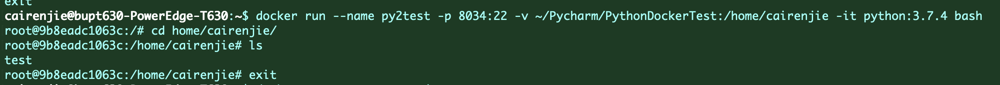

<font color='red'>注意：由于容器内的文件夹是映射的，所以与系统中实际绑定的文件夹text_similar在docker中无法删除，需要在实际的系统中删除</font>

在本地文件夹中vim一个hello.py文件，编写一个最简单的Python程序，由于共享文件夹，则docker中的对应目录下也能直接看到该py文件

直接执行`python hello.py`

效果如下：

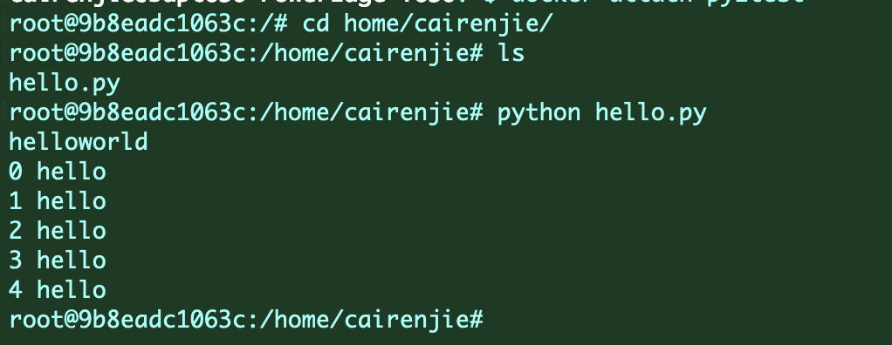

> #### **<u>一些容易踩坑的地方：</u>**
> 
> 1. docker中的环境很简陋，如果只拉取了Python镜像，那么**<u>甚至无法用vim或者vi</u>**去编辑文件。需要使用Vim的话还需要自己安装（见容器SSH配置）
> 
> 2. 配置端口映射：建议服务器的端口选用8000以上，可以直接尝试上述的`docker run xxxx`指令，如果端口已经被占用，则系统会直接报错无法创建docker，就可以选用另一个端口去尝试;
>    
>    1. 或者可以采用下面的指令：
>       
>       ```shell
>       netstat -tunple | grep 端口号
>       ```
>    
>    2. <font color = red>不要用自己从师兄师姐那里申请账号时获得的端口号作为映射端口。</font>不过就算用了，你也会发现报错，因为这个端口已经被你自己的ssh连接占了
> 
> 3. **<u>端口映射信息以及GPU配置信息等均建议创建的时候就配置完成，否则后期修改很繁琐</u>**
> 
> 4. 镜像的选择很重要，一定要三思，不然搭了一天之后发现换个镜像1小时就完事也不是不可能

### 容器SSH配置

到了这里, pycharm依然无法连接docker,因为docker里尚不支持ssh连接。故需要在docker里配置ssh。进入容器，在容器中执行下面两个指令

```ssh
apt-get update
apt-get install openssh-server openssh-client
```

两个指令都会噼里啪啦蹦出来一堆东西，遇到选择就输入Y完事

由于后续需要使用Vim配置信息，所以我们要先安装Vim

```shell
apt install vim
```

安装完成后执行指令编辑配置文件

```shell
vim /etc/ssh/sshd_config
```

将文件中的这三行信息做修改：（文件内容很多，建议esc在命令行模式下用/方式寻找关键字）

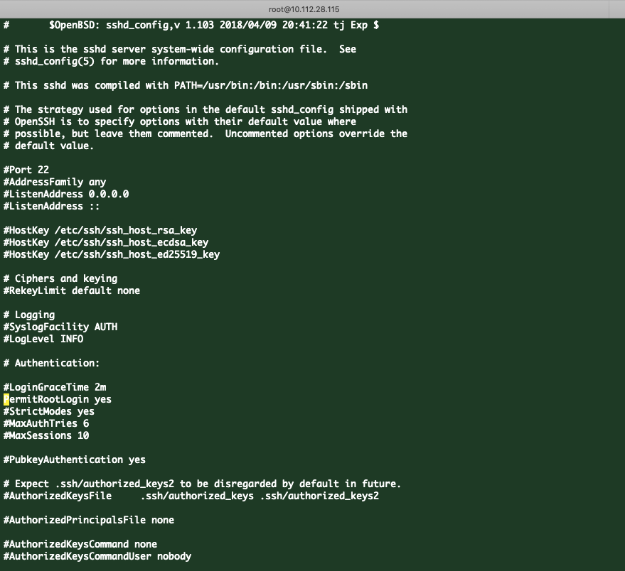

```
#PermitRootLogin without-password 改为 PermitRootLogin yes
#PasswordAuthentication yes 改为 PasswordAuthentication yes
UsePAM yes改为UsePAM no
```

> 备注：
> 
> 1. 第一个without-password可能不一定是这个选项，我遇到的是叫prohibit-password还是类似的啥，删的太快忘了，但是无所谓，不管是啥，都换成yes就可以了
> 2. 第一个和第二个配置信息的#都要删除

配置完成后执行

```shell
service ssh restart
# 记得重新配置root用户的密码

# pip换源
pip config set global.index-url https://pypi.tuna.tsinghua.edu.cn/simple
passwd root
```

理论上这时候就完成配置了。新建一个端口，去测试连接一下

```shell
ssh -p [docker在服务器上选用的端口] root@[服务器的IP地址]
另一种方式是通过Pycharm的Tools -> Development -> congiuration里加一个SFTP连接测试，Username填root，password填自己刚刚设置的密码，端口是容器映射的那个端口（8034）
```

### 退出容器

在容器命令行内输入exit即可

```shell
exit

# 如果在本地环境，则输入以下指令
docker stop pytest_crj
```

或者Ctrl + D

如果只是想临时返回本地界面而不结束容器，则采用快捷键`Ctrl + P + Q`

### 重启容器

```shell
docker restart f7c249c7529a #这里的编号是Docker的ID
# 或者可以输入名称
docker restart pytest_crj
```

### 删除容器

```shell
docker rm docker的ID
```

删除后，有的时候会出bug（目前只出现过一次，尚未复现成功），服务器上与docker共享的目录可能会失去写权限，变成只读

猜测是因为docker创建的时候失败（比如端口映射的时候映射到了一个使用中的端口），锁定了文件夹

这时候找管理员申请赋权就可以解决了

### 重新进入容器

由于容器短时间内无法配置完环境，所以经常需要重新进入docker容器。重启后的容器也不会自动进入，需要手动进入

查看现在正在运行的容器：

```shell
docker ps -a
```

找到自己的容器，确认第一列的CONTAINER_ID号。这里我的ID号为`f7c249c7529a`

执行指令

```shell
docker exec -it f7c2 bash # ID号可以不用输入全部，只需要输入前缀，并且该前缀独一无二即可
# 或者采用attach
docker attach pytest_crj # 注意，attach方式下不用输入bash
```

### 查看容器的挂载目录信息

如果时间久了记不得自己的容器与服务器上哪一个目录映射，通过下面的两个指令均可以查询

```shell
docker inspect docker的名字 | grep Mounts -A 20
docker inspect docker的编号 | grep Mounts -A 20
```

效果如下：

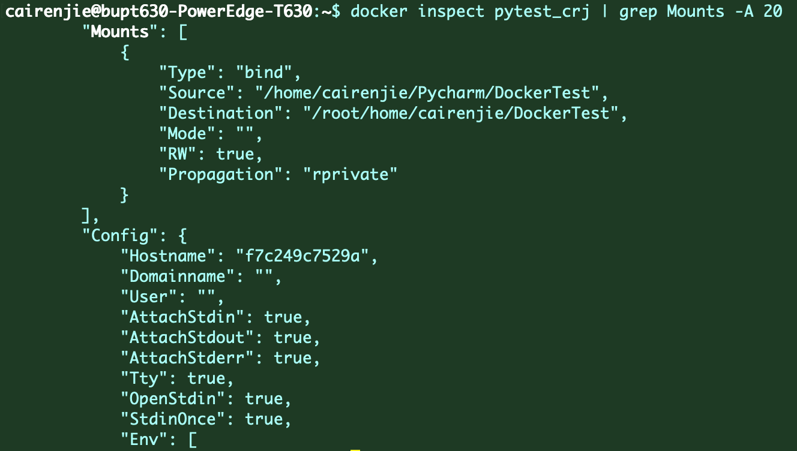


### docker跨服务器迁移

> 2022年9月9日更新：
>
> 来自已经被docker迁移折磨坏掉了的CRJ的怨念：不可能成功的不可能成功的不可能成功的このバカ！，不可能迁移的，不如重开一个docker，不如重开一个docker，一切想偷懒省事的迁移最后都会花掉更多的时间，然后还是要重新配环境。
>
> 以下的内容已经被实践证明是错误的了，因为迁移过去之后文件夹下根本没有对应的代码文件

如果在A服务器上配置好了一个docker，~~发现自己想多开几个账号耍耍~~结果带不动自己的模型，需要迁移到B服务器上，可以通过以下方式将自己精心整理的docker迁移过去

首先将docker压缩为image：

```shell
docker export docker的ID或者名字 > temp_image.tar
cat temp_image.tar | docker import - temp:demo
# 执行后，通过docker images可以看到新出现了一个名字是temp，TAG栏叫demo的新image
```

然后将image打包保存为文件：

```shell
docker save temp > /home/student/temp.tar
```

然后利用scp指令：

```shell
# 先登录到目标B服务器上，然后在B服务器上执行下面的scp指令
# 假设A服务器上，打包好的image位置在/home下，需要迁移到B服务器的目录/home/new下
scp A的用户名@A的IP地址:/home /home/new
# 这时候会提示输入A服务器上的用户名密码，输入完毕即可.从历史数据来看，通常打包好的image都有几十个G那么大，在这一步会消耗半个小时起步的时间
```

迁移完毕镜像，再导入镜像并生成docker:

```shell
docker load < /home/new/temp.tar
docker run --name --gpus all new_docker -it temp bash
```


## Pycharm连接服务器

神经网络训练中，如何使用pycharm专业版连接服务器

### Pycharm专业版获取途径

1. ~~盗版是绝对要谴责的，但是如果能偷偷用那就没法谴责了对吧？~~
2. 在校生身份，从jetbrains官网申请在校大学生免费使用Pycharm专业版。在此之前需要获取一个edu.cn结尾的邮箱，用该邮箱申请即可。整个过程无需科学上网

### 连接至服务器

1. 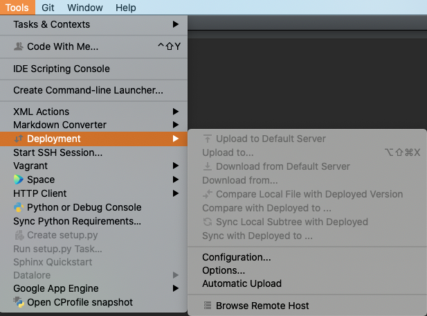
   
   选择`tools - deployment - configuration `

2. 左上角+号新建SFTP连接，连接名称自行命名，不重要

3. 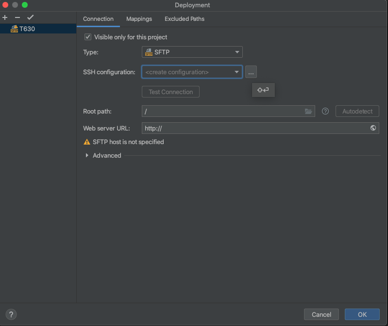
   
   p选择`SSH - configuration`后面的省略号，配置IP和端口
   
   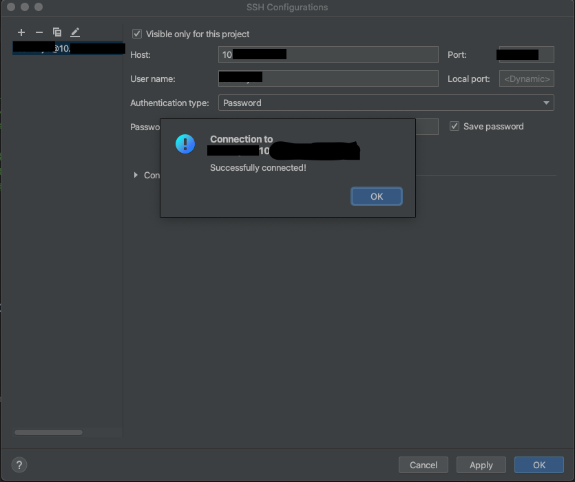
   
   配置信息包括IP地址，端口号，用户名以及密码。配置后可以测试连通性。如图表示测试成功

4. 其他的信息（默认根目录是服务器的根目录，建议选择自己的账号所在的目录作为根目录）录入完成后，

### 配置解释器

进入解释器配置界面

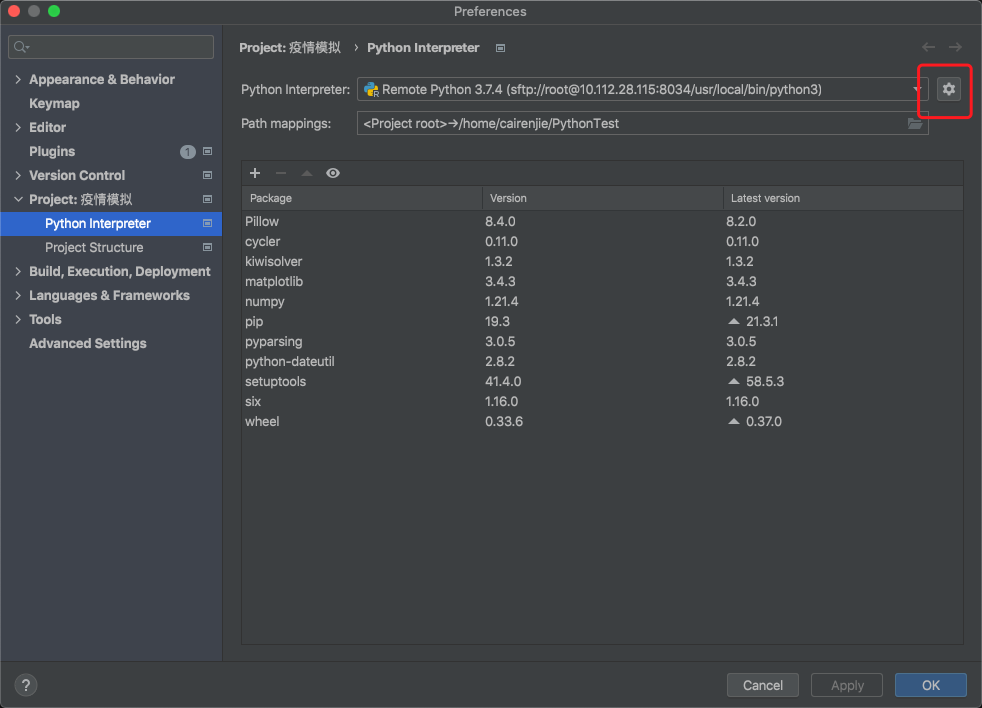

点击圈出的设置符号，选择add

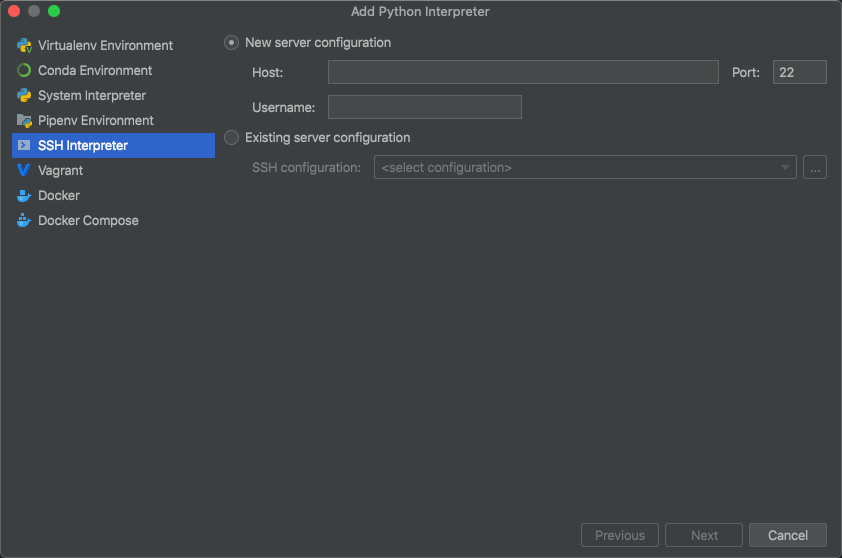

选择SSH Interpreter，Host设置为服务器的IP地址，Port选择当时与Docker映射的服务器端口号。Username为root，点击右下方next，进入下一栏输入密码

配置映射的目录之后，等待Pycharm将文件同步到服务器即可

最后在Pycharm运行代码，解释器为服务器中的Docker

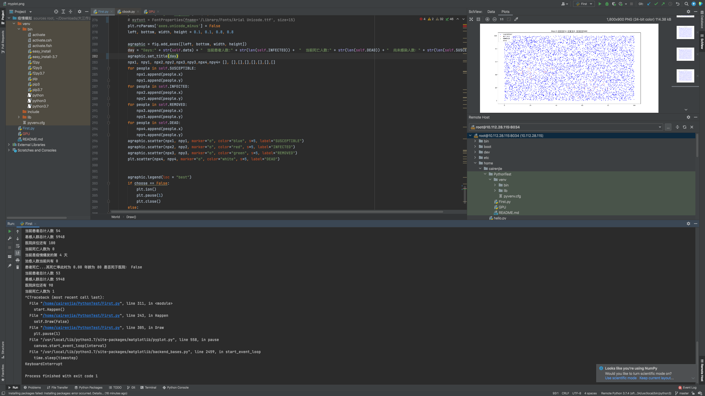

### 自动同步

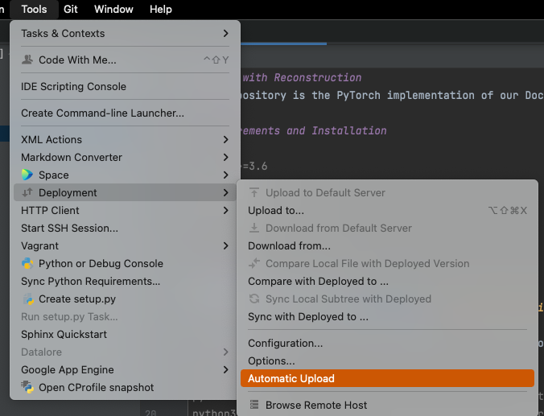

或者选中上一个Options，将画圈的部分改为保存时同步

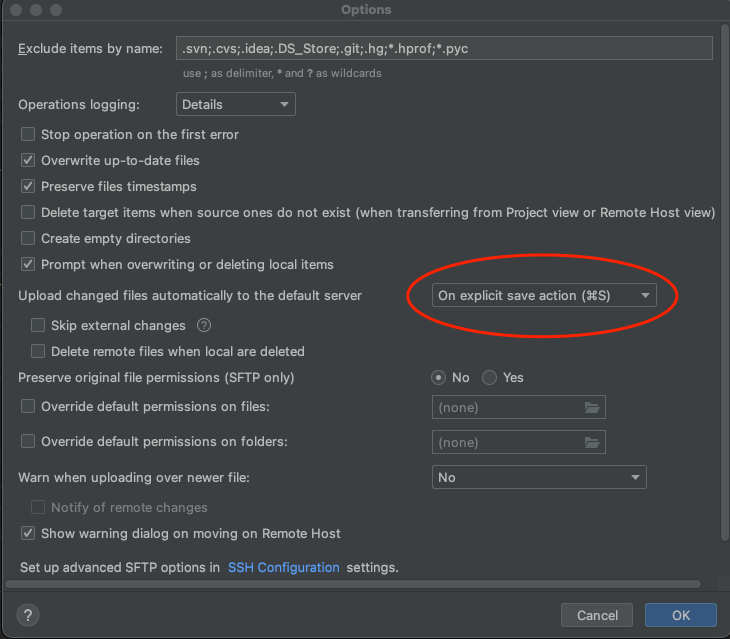

## 常见问题(持续更新中)

#### 我的pycharm同步服务器上的文件夹和项目Python解释器之后，没法通过setting里的interpreter安装第三方库怎么办？

> 1. 如果用的是conda，直接在服务器里运行`conda install numpy（假如要装numpy）`即可
>    
>    > 修改conda源：
>    > 
>    > 1. `vim ~/.condarc`
>    > 
>    > 2. 在里面输入如下内容：
>    >    
>    >    ```
>    >    channels:
>    >      - https://mirrors.tuna.tsinghua.edu.cn/anaconda/pkgs/main/
>    >      - https://mirrors.tuna.tsinghua.edu.cn/anaconda/pkgs/free/
>    >      - https://mirrors.tuna.tsinghua.edu.cn/anaconda/cloud/conda-forge/
>    >      - https://mirrors.tuna.tsinghua.edu.cn/anaconda/cloud/pytorch/
>    >    ssl_verify: true
>    >    ```
>    > 
>    > 3. 保存退出，重新运行conda install即可
> 
> 2. 如果用的是pip……暂时没遇到这个情况，希望其他人能补充一下

#### 我看到镜像里标注了cuda，Python，怎么查版本号和安装路径？

1. Python：
   1. 安装路径：`which python3.7`
   2. 版本：`python3`直接就展示版本了
2. anaconda：`conda --version`

#### 大文件和训练数据怎么下载到服务器里？

1. 一般是下载到本地，然后通过pycharm或者scp指令上传到服务器，注意docker用-v指令映射目录的时候，位于服务器上的那个目录应该尽量避开home文件夹
   
   ```shell
   # 在自己电脑的bash里执行如下指令可以下载服务器上的文件到本地
   # scp -P 端口号 -r 用户名@服务器IP地址:服务器上的目录  本地目录
   scp -P 22000 -r student@10.112.32.43:/home/test /home/Document
   ```

#### 镜像怎么选择啊？

1. 一般如果用pytorch作为训练模型的话，建议优先选择有pytorch的镜像，不然安装cuda，anaconda之类的玩意会无比糟心

2. TensorFlow，还没用过，等一个用过的人来帮我更新这一段……

3. python这种一般优先度最低，因为很好装……而且有pytorch了，谁家镜像还不搭配一个Python对吧？

4. 如果服务器上没有合适的镜像，就去到dockerhub找一个。实验室里不愿透露姓名的男子刘某建议选用`cuda+版本号`作为搜索关键字

#### 为啥我pycharm在连接docker的时候显示connect refuse？

1. 情况一：你自己密码记错了，建议上服务器执行命令`passwd 用户名(一般docker里是root)`重置密码
2. 情况二：你没设置docker里的ssh或者没有把ssh设置为开机自启动，[参考这里重新配置ssh或者重启ssh](###容器SSH配置)
3. 情况三（很少见）：服务器上的与docker相连的映射端口被关闭了，向管理员申请打开端口

#### 如果我跑训练模型时间很久，导致ssh断开连接，再次重进服务器的时候，输出的训练信息在界面上都丢失了怎么办？

采用shell重定向输出的方式输出到log.txt文件中

```shell
python3 train.py > log.txt 2>&1
```

如果想同时在命令行界面和文件中都能看到输出的结果：

```
python3 train.py | tee log.txt
```

如果想跑模型的过程中干点别的，就用&的方式将运行代码的进程放在后台

```shell
python3 train.py > log.txt 2>&1 &
```

#### 如果在执行apt-get update的时候，总是显示进度为0怎么办

多半是创建docker的时候端口映射出问题了，建议重新创建一个docker重头开始吧

#### apt-get update显示硬盘空间不足

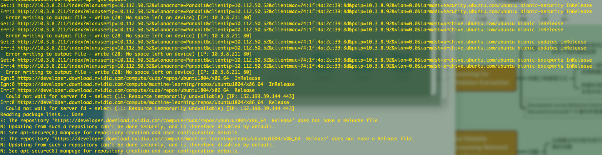

如果出现如下情况，多半是硬盘/home文件夹满了，删掉点不用的docker就行了

#### apt-get update显示网络错误

```shell
Clearsigned file isn't valid, got 'NOSPLIT' (does the network require authentication?)
```

更新的时候如果出现这个报错，多半是因为校园网网关没开，没法连接外网。尝试一下退出到服务器界面，ping一下百度，如果ping不通，但是能ping通10.3.8.211，说明就是要登录一下校园网账号的问题了

如果服务器没有图形化界面登录校园网服务，则使用下面命令

```shell
curl 'http://10.3.8.211/login' --data "user=&pass=" # user=后面填自己的校园网账号，pass填自己校园网账号密码
```

#### 服务器IP地址变动之后，重新连接发现ssh连接报错，提示Warning并拒绝连接

多半是因为ssh密钥变动导致拒绝连接了。

如果是Mac电脑:

```shell
rm ~/.ssh/known_hosts
```

删除后，重新连接ssh，会提示是否要相信该地址，输入yes即可

如果是Windows，等一个教程……

# 常用指令

## 查看服务器当前状态的指令

```shell
# 查看显卡占用情况
nvtop
nvidia-smi # 显示不全的情况下，用-a可以显示完整信息，但不便于阅读；用-L参数可以显示所有显卡的完整型号和对应的GPU顺序
# 查看磁盘占用情况
df -h
```

## 一些服务器可以使用的小功能

### 校园网账户查询

通过bash脚本直接自动查询校园网财务系统，可以规避工商银行的每月付费到账通知

~~这个功能后期可以改为代码运行完毕的时候发送邮件提醒自己运行结束了（其实并不能，因为docker里再做一个Ubuntu有点呆呆的）~~

~~然而这个功能出于安全性，不建议在服务器上长期部署，因为密码可能会明文保存~~

#### 建立邮件服务

安装mailutils

```shell
sudo apt-get install mailutils
```

弹出界面回车就完事了

修改发件信息配置

```shell
sudo vim /etc/s-nail.rc
# 添加以下内容
set from=xxxxxxxxxx@bupt.edu.cn                        #设置发送邮箱
set smtp=smtps://smtp.exmail.qq.com:465                  #设置smtp服务器和端口
set smtp-auth-user=xxxxxxxxxx@bupt.edu.cn      #设置用户名，记得加域名啊
set smtp-auth-password=xxxxxxxxxxx         #邮箱密码，由于是明文保存，所以安全性存疑
set smtp-auth=login
```

保存即可

后面可能会在发邮件的过程中提示发件失败

```shell
 mail
 # 发件失败的邮件会自动转存到系统内，查看的时候邮件中会包含错误信息如下
 SMTPUTF8 is required, but was not offered by host mxbiz2.qq.com[120.232.31.233]
```

执行下列指令修复

```shell
sudo vim /etc/postfix/main.cf 
# 在文件最后加一句 
smtputf8_enable = no

# 然后执行重启
postfix reload
```

就可以发送邮件了

另外，经过测试，网易邮箱（163）对发送方的邮件配置要求较为严格，建议采用QQ邮箱作为收件方，学校的edu邮箱可以作为发件方

发送邮件测试

```shell
mail -s '这是邮件标题' -a '这里写邮件的附件路径' -- receiver@qq.com < 正文.txt
# 或者用这种方式
mail -s '这是邮件标题' -a '这里写邮件的附件路径' -- receiver@qq.com <<< '这是正文'
```

QQ有可能会发送到垃圾箱里，记得收到后多加入几次正常邮件就可以拉入白名单中了

发送的邮件可能会出现编码问题，QQ邮箱官方没说到底用的是什么字符集编码，经过我自己的测试，应该是采用了UTF-8字符集，但是Ubuntu自己在cat的时候貌似又不是utf-8……所以建议发送的时候，先将保存的文本转为utf-8文件，然后采用读文件的方式发送。这里附上我自己写的bash脚本。~~很久不写正则了，都忘了怎么写了，临时抱佛脚学的~~

```shell
cookie='教务系统的财务页面获得cookie'
wget --header="Cookie:$cookie" --http-user=学号 --http-passwd=密码 http://cwxt.bupt.edu.cn/gxzhcx50/Views/Jgcwxx/Welcome.aspx -O /home/cairenjie/Money.aspx
# test=`cat Money.aspx | grep 硕士
cat Money.aspx  | grep 发放 | sed -e 's/<[a-zA-Z0-9\-\"\=\/\;\:]*>/ /g' | sed -e 's/<td.*>//g' | sed -e 's/<th scope="col">/ /g' | cat > info.txt
test=`cat Money.aspx  | grep 发放 | sed -e 's/<[a-zA-Z0-9\-\"\=\/\;\:]*>/ /g' | sed -e 's/<td.*>//g' | sed -e 's/<th scope="col">/ /g'`

echo '下面是筛选后的信息'
error_judge=`cat Money.aspx | grep 错误`
echo "error_judge:$error_judge"
if [ $error_judge ];
    then echo 'cookie已经失效，请更换';
    mail -s '爬虫的cookie已经失效' 2113159231@qq.com <<< '爬虫的cookie已经失效，尽快更换'
else
    iconv -c  -f 'utf-8' -t 'UTF-8' info.txt > info2.txt # 这一步属于历史遗留代码，不知道删了有没有用，反正留着没啥影响……
    mail -s '补助金' 你的邮箱@qq.com < info2.txt
    echo '邮件已发送'
fi
```

执行脚本就可以了

#### 一些备注

1. 这个脚本其实功能并不完善，因为从构思这个功能到决定放弃一共就花了3个小时，以上这些是三个小时里摸索出来的，所以很粗糙
2. cookie很容易失效，如果用Python应该会比较容易更新cookie，但是没动力写了
3. 正则过滤的也不是很好，冗余信息太多了，有待更新
4. 如果部署在非校园网环境下的服务器里，不知道能不能访问到教务系统了……

## 服务器维修

### Network is unreachable（这一个标题由于服务器搬迁，内容不一定再适用了 —— 2022年9.7日修订）

PC3是115服务器（门口两台一起放着的服务器里靠外面的那一台），204服务器是PC4（门口两台一起的服务器里贴着墙的那一台）

多半是无线模块掉了，步骤如下：

1. 执行ifconfig，如果最后一个段落（`w1x646e啥啥啥`）里inet addr没有显示ip地址，说明是无线模块掉了

2. 走到实验室找到服务器，把服务器屁股上的无线模块拔下来重新插一下（就是带一根家用WiFi一样天线的）

3. 然后执行如下命令：
   
   ```shell
   先进入/home/xinngximing/rt18821CU文件夹
   
   make
   # 执行之后界面里最后一行出现ERROR 2 是正常情况
   sudo make install
   sudo modprobe 8821cu
   sudo usb_modeswitch -KW -v 0bda -p 1a2b
   # 这个时候执行nmcli c s(是connect show的缩写）AP_Wired2WireLess_2E15那个网绿色代表已经连上了，不用再管，白色需要激活
   sudo nmcli connection up AP_Wired2WireLess_2E15
   ```

4. 如果需要切换显示器界面，按一下连着的转换器切换到PC4即可。如果坏掉的是204服务器，有可能需要用网线连接到交换机上，通过有线地址外部访问维修
   
   转换器如图所示
   
    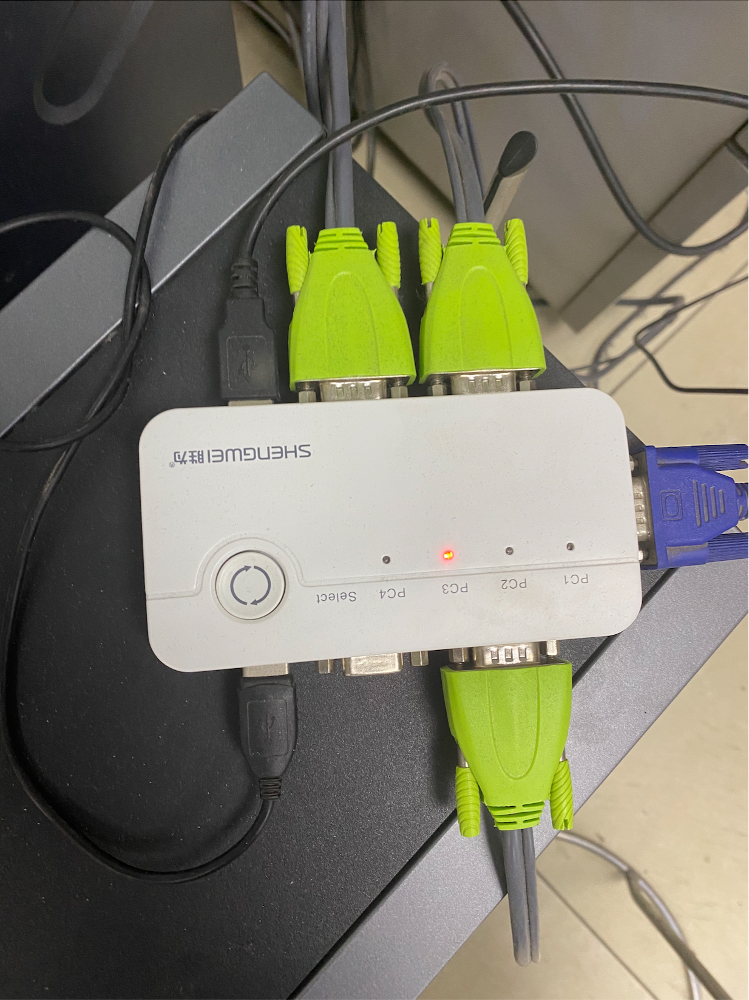

> 如果还有其他问题，参考SYF师姐的word文档就行。

### 新的network恢复方案（2022年9月7日修订）

到实验室，直接拔掉服务器后面的外置wifi模块，然后连上显示器，进入command界面，输入：

```shell
service wireless on
```

正常应该跑出来一堆报告，~~具体是什么我忘了，反正很长就是了~~，然后登陆一下校园网就行了


### 硬盘挂载

> 命令行挂载

```bash
# 查看已经挂载的硬盘信息，并且以一种可读性较高的方式来现实信息
df -h
# 可以额外显示硬盘格式的Type
df -hT

# 查看可挂载的硬盘
sudo fdisk -l
```

如下图所示：


```bash
#创建挂载点
sudo mkdir /data

#挂载
sudo mount /dev/sda1 /data

### 注意此处挂载不能挂载整个disk，应该挂载的Device，即挂载的不应该是硬盘，而应该是硬盘里面的分区
```

#### 硬盘挂载出错

> 一般我们的硬盘格式是ext4，这种可以直接挂载，但是假如是NTFS，则需要额外的操作
> 
> ==Warning==: 下面方法并未经过验证

```bash
# 上一步中挂载磁盘出错：
NTFS signature is missing.
Failed to mount '/dev/sda': Invalid argument
The device '/dev/sda' doesn't seem to have a valid NTFS.
```

**使用ntfsfix 修复**

```bash
# 安装ntfsfix 
sudo apt-get install ntfs*
# 修复
sudo ntfsfix /dev/sda
```

**但是修复出错**

```bash
Mounting volume... NTFS signature is missing.
FAILED
Attempting to correct errors... NTFS signature is missing.
FAILED
```

**使用chkdsk修复**

```bash
# chkdsk 修复
sudo fsck /dev/sda
```

该命令可能需要一些时间才能完成，具体取决于驱动器的大小。该过程完成后，将显示一个数字。“ 0”表示未发现任何错误；“ 1”表示发现并纠正了错误；“ 2”表示应重新引导系统；并且“ 4”表示已找到文件系统错误，但无法更正。其他任何数字均表示该实用程序未正确运行。

修复完成后重新运行 sudo mount /dev/sda /data即可挂载

# NLP学习路径

记录一下自己入门的流程，以防以后基本功丢了没法拾回来

## 入门

**<u>完全零基础的入门学习路线</u>**

### 书目

1. 《深度学习的数学》：适合完全不懂什么是神经网络的人阅读

### 教程

1. transformer：[Transformer论文逐段精读【论文精读】_哔哩哔哩_bilibili](https://www.bilibili.com/video/BV1pu411o7BE/)
   1. [Transformer论文逐段精读【论文精读】 - 哔哩哔哩 (bilibili.com)](https://www.bilibili.com/read/cv13759416?spm_id_from=333.788.b_636f6d6d656e74.70)
2. Bert：
3. 图神经网络：

## 一些调整模型的经验

### 常见报错

1. RuntimeError: DataLoader worker (pid(s) 13364, 13365) exited unexpectedly
   
   这种多半是batch_size大了，也有一种说法是cuda的环境中内存不足，我自己是把batch_size减小了一半多，成功运行

2. ERROR: Unexpected bus error encountered in worker. This might be caused by insufficient shared memory (shm)
   
   内存不足，改docker的分配的虚拟内存。理论上可以通过``docker stop `并修改配置文件实现，但是很麻烦，而且还需要管理员权限。我自己是重新建了一个docker……
