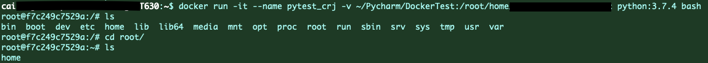
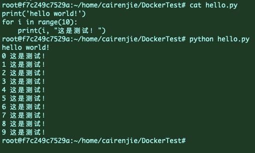

# 连入服务器

首先需要先从师兄师姐那里申请账号，密码，端口号和服务器所在的IP地址，再进行以下操作

## Mac用户

1. 打开系统自带的terminal，输入指令：

   ```shell
   格式为：ssh -p 端口号 用户名@IP地址
   例如：端口号为1000，用户名zhangsan，IP地址:192.168.1.1
   ssh -p 1000 zhangsan@192.168.1.1
   ```

2. 回车后，terminal会跳转至服务器登录页面，要求输入密码，输入登记的密码即可登录


## Windows用户

1. ssh连接器可以考虑gitbash？


## Pycharm连接服务器

神经网络训练中，如何使用pycharm专业版连接服务器


### Pycharm专业版获取途径

1. ~~盗版~~
2. 在校生身份，从jetbrains官网申请在校大学生免费使用Pycharm专业版。在此之前需要获取一个edu.cn结尾的邮箱，用该邮箱申请即可。整个过程无需科学上网


### 连接至服务器

1. 

   选择`tools - deployment - configuration `

2. 左上角+号新建SFTP连接，连接名称自行命名，不重要

3. 

   p选择`SSH - configuration`后面的省略号，配置IP和端口

   

   配置信息包括IP地址，端口号，用户名以及密码。配置后可以测试连通性。如图表示测试成功

4. 其他的信息（默认根目录是服务器的根目录，建议选择自己的账号所在的目录作为根目录）录入完成后，


# Docker配置

由于一群人在一个系统里跑代码，环境随便配会混乱，所以每个人采用docker的方式运行自己的程序


## docker环境配置

该条目由管理员阅读并配置服务器Docker环境

version：2021年11月6日版

采用服务器T630，该服务器上Docker已完成配置


## docker使用

参考链接：[Docker极简实战之python项目安装部署 - 知乎 (zhihu.com)](https://zhuanlan.zhihu.com/p/137895577)

注意：docker是容器，是一个动态的环境；image是镜像，是一个静态的环境。配置环境的时候需要进入docker，而配置完成后只需要保存为镜像就可以随时运行


### 查看服务器上的现有镜像

```shell
docker images # 查看镜像
docker ps -a # 查看容器信息
```


### 安装Python镜像

```shell
docker pull python:3.7.4 #拉取Python3.7.4版本的镜像
docker images  # 可以查看自己刚刚拉取的镜像。如果之前已经拉取过，则该镜像不会更新为现在的时间，而是保留老版本的时间
```


### 运行容器

为了能够运行程序，需要在这个docker中使用pip安装Python运行所需的依赖环境和依赖包，并放入运行的代码。最终配置完成后，将该docker打包为image即可迁移

```shell
# -it：-i和-t的结合，感觉就是如下图，直接进入容器的命令行模式。

# –name：自定义容器名称，不用的话会自动分配一个名称。

# -v： 将本地文件夹~/PycharmProjects/text_similar与容器文件夹/root/text_similar共享。

# python:3.7.4：要运行的镜像名+TAG

# bash：进入容器命令行。
docker run -it --name pytest -v ~/PycharmProjects/text_similar:/root/text_similar python:3.7.4 bash
```

进入后是下图的样子：（由于实际创建的文件夹名称不同，故与展示的指令效果不完全一致）



<font color='red'>注意：由于容器内的文件夹是映射的，所以与系统中实际绑定的文件夹text_similar在docker中无法删除，需要在实际的系统中删除</font>

在本地文件夹中vim一个hello.py文件，编写一个最简单的Python程序，由于共享文件夹，则docker中的对应目录下也能直接看到该py文件

直接执行`python hello.py`

效果如下：




#### **<u>一些容易踩坑的地方：</u>**

1. docker中的镜像很简陋，如果只拉取了Python镜像，那么**<u>甚至无法用vim或者vi</u>**去编辑文件。只能通过本地编辑并上传至共享文件夹中实现
2. 配置端口映射


### 退出容器

在容器命令行内输入exit即可

```shell
exit

# 如果在本地环境，则输入以下指令
docker stop pytest_crj
```

或者Ctrl + D

如果只是想临时返回本地界面而不结束容器，则采用快捷键`Ctrl + P + Q`


### 重启容器

```shell
docker restart f7c249c7529a #这里的编号是Docker的ID
# 或者可以输入名称
docker restart pytest_crj
```


### 重新进入容器

由于容器短时间内无法配置完环境，所以经常需要重新进入docker容器。重启后的容器也不会自动进入，需要手动进入

查看现在正在运行的容器：

```shell
docker ps -a
```

找到自己的容器，确认第一列的CONTAINER_ID号。这里我的ID号为`f7c249c7529a`

执行指令

```shell
docker exec -it f7c2 bash # ID号可以不用输入全部，只需要输入前缀，并且该前缀独一无二即可
# 或者采用attach
docker attach pytest_crj # 注意，attach方式下不用输入bash
```


# 常用指令

## 查看服务器配置的指令

```shell
```


## 查看服务器当前状态的指令

```shell
# 查看显卡占用情况
nvtop
# 查看磁盘占用情况
df -h
# 查看内存使用情况

```


